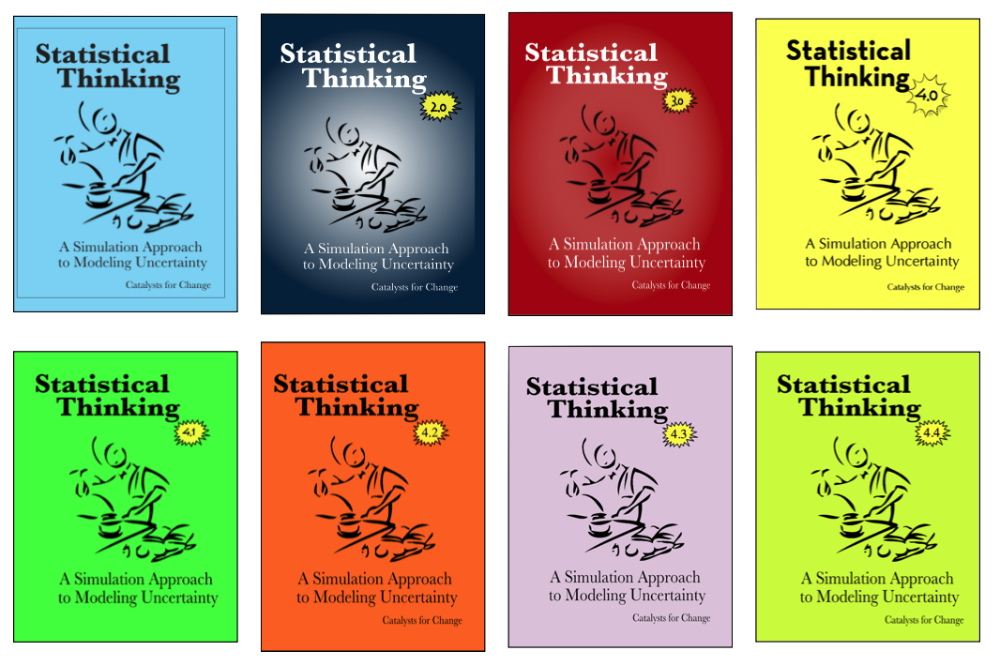

Statistical Thinking: A Simulation Approach to Modeling Uncertainty
================

This is the GitHub repository for the supplementary materials for the book [_Statistical Thinking: A Simulation Approach to Modeling Uncertainty_](http://zief0002.github.io/statistical-thinking/). Here you can find a PDF file of the lab manual, as well as the TinkerPlots&#8482; datasets used in the book. The materials in the book are based on the NSF-funded [CATALST Project](http://www.tc.umn.edu/~catalst/) (DUE-0814433). The book itself can be accessed at [http://zief0002.github.io/statistical-thinking/](http://zief0002.github.io/statistical-thinking/).

To download all of the materials at this site, click on the `Clone or Download` button and select `Download ZIP`. This will download a ZIP file of the entire site on your local computer. Alternatively, direct your browser to [http://z.umn.edu/statisticalthinking](http://z.umn.edu/statisticalthinking).

TinkerPlots&#8482;
-------

The book makes use of the TinkerPlots&#8482; software. TinkerPlots&#8482; can be purchased and downloaded (for Mac or PC) from [http://www.tinkerplots.com/download](http://www.tinkerplots.com/download). 

Reporting Typos, Issues, etc.
-----

To report typos, dead links, or other problems you encounter in the book, please send an email to [zief0002@umn.edu](mailto://zief0002@umn.edu).

 
Contributions from Montana State University
-----

Montanta State University used and adapted the CATALST materials in their introductory statistics courses, and have graciously made these adapted materials available to others here on GitHub. Click the [MSU-materials](https://github.com/zief0002/Statistical-Thinking/tree/master/MSU-materials) folder to read more.
