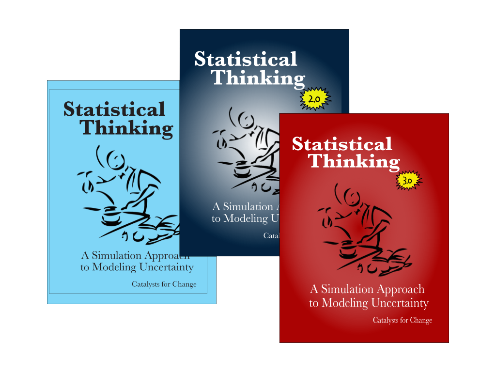

Statistical Thinking: A Simulation Approach to Modeling Uncertainty
================

This GitHub repository is the home for the book _Statistical Thinking: A Simulation Approach to Modeling Uncertainty_. It includes the TinkerPlots&#8482; data used in the book, as well as the errata for all editions. The materials in the book are based on the NSF-funded [CATALST Project](http://www.tc.umn.edu/~catalst/) (DUE-0814433).

To download all of the materials at this site, click on the `Download ZIP` button. This will download a ZIP file of the entire site on your local computer. Alternatively, direct your browser to [http://z.umn.edu/statisticalthinking](http://z.umn.edu/statisticalthinking).

Revisions to the Third Edition
------

The third edition (the red book) has several changes. Below are some of the major changes:

- The end of Unit 1 has been restructured to include more practice carrying out one-sample hypothesis tests. The _Matching Dogs_ course activity was removed and statistical testing is introduced via the _Helper and Hinderer_ course activity. Additional practice is provided in a new course activity, _Monday Breakups_. Finally, another new course activity, _Racial Bias_, extends testing to models that are not uniform.
- Unit 2 has been re-sequenced. The course activity _Sampling_ was moved into this unit to focus the end of this unit on the scope of inferences that can be made from the study design. 
- The _Features of Distributions_ course activity was moved into Unit 3. This makes a natural transition to the _Standard Deviation_ course activity. This is where precision and uncertainty are introduced via the standard error as well.
- All homework assignments have been removed from the book. 

TinkerPlots&#8482;
-------

The book makes use of the TinkerPlots&#8482; software. TinkerPlots&#8482; can be purchased and downloaded (for Mac or PC) from [http://www.tinkerplots.com/download](http://www.tinkerplots.com/download). 

Reporting Typos, Issues, etc.
-----

To report typos, dead links, or other problems you encounter in the book, please send an email to [zief0002@umn.edu](mailto://zief0002@umn.edu).

 
Contributions from Montana State University
-----

Montanta State University used and adapted the CATALST materials in their introductory statistics courses, and have graciously made these adapted materials available to others here on GitHub. Click the [MSU-materials](https://github.com/zief0002/Statistical-Thinking/tree/master/MSU-materials) folder to read more.
