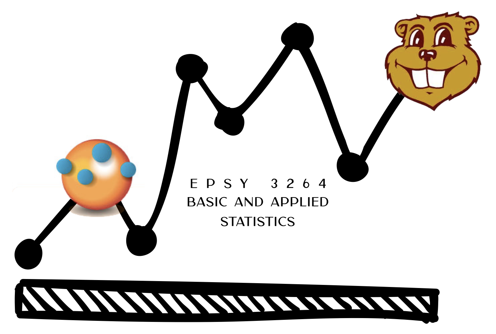

Statistical Thinking: A Simulation Approach to Modeling Uncertainty
================

This is the GitHub repository for the online textbook [_Statistical Thinking: A Simulation Approach to Modeling Uncertainty_](http://zief0002.github.io/statistical-thinking/) that is used for the course EPSY 3264: Basic and Applied Statistics at the University of Minnesota. The materials in the book are based on the NSF-funded [CATALST Project](http://www.tc.umn.edu/~catalst/) (DUE-0814433). 

TinkerPlots&#8482;
-------

The book makes use of the TinkerPlots&#8482; software. TinkerPlots&#8482; can be purchased and downloaded (for Mac or PC) from [http://www.tinkerplots.com/download](http://www.tinkerplots.com/download). 

Lab Manual
-------

The Lab Manual for the course and the accompanying TinkerPlots data sets can be found at [OSFHome](https://osf.io/exjpk/) 

Reporting Typos, Issues, etc.
-----

To report typos, dead links, or other problems you encounter in the book, please send an email to [zief0002@umn.edu](mailto://zief0002@umn.edu).

 
