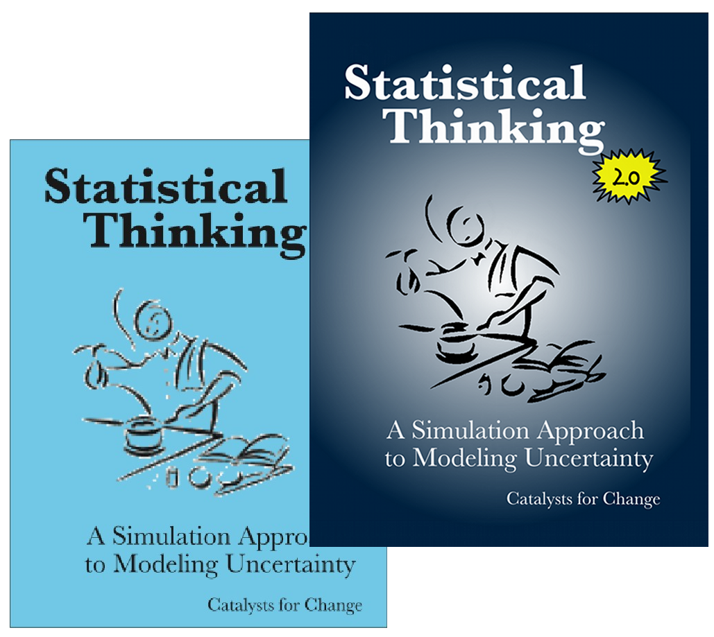

Statistical Thinking: A Simulation Approach to Modeling Uncertainty
================

This GitHub repository is the home for the book _Statistical Thinking: A Simulation Approach to Modeling Uncertainty_. It includes the TinkerPlots&#8482; data used in the book, as well as the errata for all editions. 

To download all of the materials at this site, click on the `Download ZIP` button. This will download a ZIP file of the entire site on your local computer. 

Obtaining a Paperback Copy
-------

To obtain a paperback copy of the entire book please visit [CreateSpace](https://www.createspace.com/3970536). The book costs $48 and is in full color. All royalties from the book are donated to the [Educational Psychology](http://www.cehd.umn.edu/edpsych/) department at the University of Minnesota.

TinkerPlots&#8482;
-------

The book makes use of the TinkerPlots&#8482; (version 2) software. This software can be downloaded (for Mac or PC) from [McGraw Hill](https://www.mheonline.com/program/view/1/16/2648/0000TPLOTS). A single-student home-use 1-year license may also be purchased for $7.95 at the McGraw Hill website. 

When you get to the TinkerPlots website, scroll to the bottom, 

 - Click the `Student 1-Year Licenses` tab.
 - Enter the number of 1-year licenses you would like to purchase. 
 - Go to your cart and complete the checkout process. 

After you make a purchase, be sure to check your email for important information about how to access TinkerPlots&#8482; for the first time.

Reporting Typos, Issues, etc.
-----

To report typos, dead links, or other problems you encounter in the book, please log an issue on GitHub. To do this, 

 - Click the `Issues` button on the right-hand side of the book's GitHub website. 
 - Create a new issue by selecting the link `Create a new issue.`
 - Give your issue an informative title, and write a more detailed explanation for it.
 - If you want, you can click on one of the labels (on the right) to further categorize the issue.
 - Click the `Submit new issue` button

 

