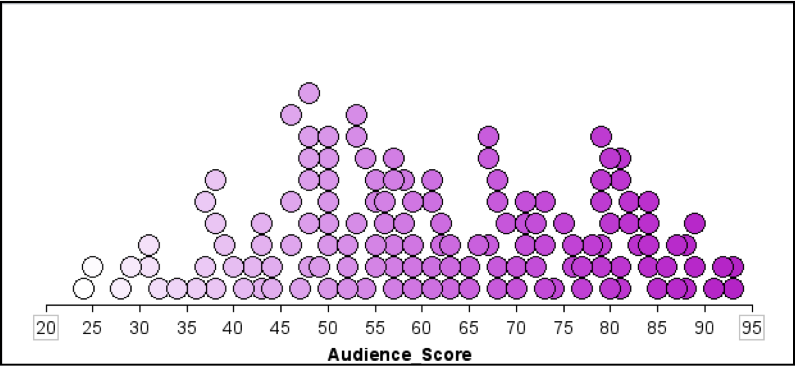

# Describing Distributions {-}

One of the important steps in any statistical analysis is that of summarizing data. It is good practice to examine both a graphical and a numerical summarization of your data. These summaries are often part of the evidence that researchers use to support any conclusions drawn from the data. They also allow researchers to discover structure that might have otherwise been overlooked in the raw data that was actually collected. Lastly, both graphical and numerical summaries of the data often point to other analyses that may be undertaken with the data.

Once raw data has been collected in a study, it can be overwhelming to pull any kind of meaning out of it. For example, it is not uncommon for Google to be dealing with millions of cases. How can Google&mdash;or any researcher for that matter&mdash;go from all of that raw data to something that can help them answer their research questions?

Rather than examining all of those cases individually, researchers examine the data collectively, often by plotting it. This is what is meant by a graphical summary of the data; it is quite literally, a picture of the distribution.

There are many, many different types of plots that have been created to graphically summarize data. Each can provide a slightly different representation of the data. Metaphorically, you can imagine each of these different plot types as a different photo taken of the exact same person. Some may be color, others black and white. Some may be taken from different perspectives, angles or distances. While all photographs "summarize" the same person, you may notice characteristics of that person in some photos that are not evident in others. Many of the photos, however, will show the same thing. 


### Shape {-}

The dot plot that TinkerPlots&trade; provides is a very useful plot.^[TinkerPlots&trade; also provides other types of plots, including the box plot (sometimes called the box-and-whiskers plot) and the hat plot (a variation of the box plot).] It allows us to summarize the shape of the distribution very easily. Shape is used to describe a distribution’s symmetry. As you might expect, symmetric distributions are shaped the same on either side of the center. (Another way of thinking about this is that if you folded the distribution at the center, the folded half of the distribution would align pretty well on top of the other half.) For example, "bell-shaped" ("approximately normal") distributions are symmetric. 

When a distribution is asymmetric, it is referred to as a **skewed** distribution. The distribution shown in Figure 1 is a skewed distribution. In this distribution, there appears to be a longer tail on the right side of the distribution. Because the tail is on the right side of the distribution, statisticians would say it is "skewed to the right" or "positively skewed". In a similar way, a distribution that tails to the left is "skewed to the left" or "negatively skewed".

<br />

```{r out.width="50%", echo=FALSE, fig.align='center', fig.cap='This distribution is skewed to the right, or positively skewed.'}
knitr::include_graphics("img/skewed-right.png")
```

<br />


### Location {-}

Aside from the overall shape of the distribution, it is also useful to summarize the location of the distribution. The location of the distribution provides a summarization of a so-called "typical" value for the data. A "typical" value can be estimated from the plot of the distribution. You can also use more formally calculated summaries of the location such as the mean, median, or mode. These values are easily calculated using TinkerPlots&trade;.

When looking at a plot of a distribution, data analysts often consider the number of modes or "humps" that are seen in a plot of the distribution. Here, the concept of mode is slightly different (although related) to the concept of mode that you may have learned in previous mathematics or statistics courses. The mode of a distribution gives a general sense of the values or measurements that occur frequently. This may be a single number, but many times is not. For example, the first hump of the distribution shown in the figure below suggests that values around nine are very common. The actual value of nine, however, may only show up once or twice in the data.

<br />

```{r out.width="50%", echo=FALSE, fig.align='center', fig.cap='A bimodal distribution showing two modes. One mode is around 9, and the other is near 12.'}
knitr::include_graphics("img/bimodal.png")
```

<br />

A distribution can be **unimodal** (one mode), **bimodal** (two modes), **multimodal** (many modes), or **uniform** (no modes). The distribution shown above is bimodal&mdash;notice there are two humps. Uniform distributions have roughly the same frequency for all possible values (they look essentially flat) and thus have no modes.

### Variation {-}

A third characteristic of a distribution that should be summarized is the variation. Summarizing the variation gives an indication of how variable the data are. One method of numerically summarizing the variability in the data is to quantify how close the observations are relative to the "typical" value on average. Are the observations for the most part close to the "typical" value? Far away from the "typical" value? How close?

It turns out, that the shape of the distribution also helps describe the variation in the data. For example, "bell-shaped" distributions have most observations close to the "typical" value, and more extreme observations show up both below and above the "typical" value (the variation is the same on both sides of the "typical" value). Whereas skewed distributions have many observations near the "typical" value, but extreme values only deviate from this value in one direction (there is more variation in the data on one side of the "typical" value than the other).


<br />

```{r out.width="50%", echo=FALSE, fig.align='center', fig.cap='Most of the observations in this distribution are clustered between 0 and 2. There are some observations greater than 2 (up to 10), although these are rare.'}
knitr::include_graphics("img/skewed-right.png")
```

<br />

One thing that affects the variation, and should be described is whether there are observations that stand out from the other observations. Often these observations have extremely large or small values relative to the other observations. These observations are referred to as **potential outliers**, or **extreme cases**. For example, in the positively skewed distribution shown previously, the observation that has a value near 10 would likely be considered a potential outlier.

### Putting It All Together {-}

[Rotten Tomatoes](https://www.rottentomatoes.com/) is a website which aggregates movie critics' reviews of films. The website marks each review as either positive or negative and then gives the film a score based on the percentage of positive reviews. In addition to the critics' score, each film is also given a score based on reviews from the general public using the same methodology (reviews are tabulated so that the score represents the percentage of positive reviews from the general public). The plot shown below shows a dot plot of the distribution of the general public's scores for 134 movies released in 2009.

<br />

```{r out.width="50%", echo=FALSE, fig.align='center', fig.cap='The scores for 134 movies released in 2009 based on the general public’s reviews. The scores represent the percentage of positive reviews for each movie.'}

```

<br />

A written description of the distribution might read as follows:

> The distribution of scores for this sample of 134 movies is fairly symmetric. The median score for these movies is near 60, indicating that a typical movie released in 2009 is positively reviewed by about 60% of the public. The distribution also indicates that there is variation in the movies’ scores. Most of the movies in the sample have a score between 35 and 85, suggesting large differences in the public’s opinion of the quality of these movies.


Notice that the description includes a description of the distribution's shape, location, and variation. It also incorporates the context of the data, in this case film scores. This helps a reader to interpret the description.
