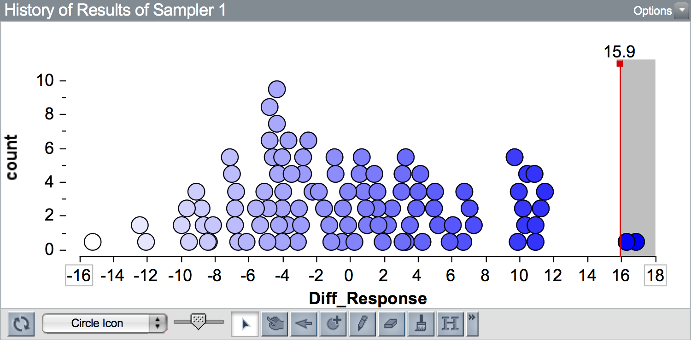

# Quantifying Results: p-Value {-}

In addition to computing the range of likely results from the model, statisticians also typically provide a quantification of the likelihood of the observed result given the hypothesized model. This quantification is referred to as a $p$-value (the $p$ stands for probability). 

To compute a $p$-value, you count the number of results that are at least as extreme as the observed result, and divide this by the total number of results. 

$$
p = \frac{\mathrm{number~of~results~at~least~as~extreme~as~observed~result}}{\mathrm{total~number~of~simulated~results}}
$$

This value is then reported as a decimal value. It quantifies the probability of observing a result at least as extreme as the observed result under the hypothesized model.

To illustrate this, we will re-examine simulation results from the *Sleep Deprivation* study. Recall in that activity, the observed data had a difference in means of 15.9. Below is a plot of 100 differences in means simulated under the "no-effect"" model. A vertical line is shown at the observed difference of 15.9.

```{r out.width="70%", echo=FALSE, fig.align='center'}

```

Since 15.9 is to the right of 0 (i.e., it is on the right-hand side of the plot) results that are *more extreme than the observed result* are to the right of 15.9. (If the observed result was to the left of 0, more extreme results would be those more negative than the observed result.) Here there are two simulated results out of 100 that are at least as extreme as 15.9 ($\geq 15.9$). We would report the $p$-value as 0.02.

### Adjustment for Simulation Results {-}

In simulation studies, we make one small adjustment to the $p$-value computation; we add 1 to both the numerator and denominator:

$$
p = \frac{\mathrm{number~of~results~more~extreme~than~observed} + 1}{\mathrm{total~number~of~simulated~results} + 1}
$$

This adjustment assures that we never get a $p$-value of 0. Consider the $p$-value if our observed result would have been 18 (instead of 15.9). There are 0 results that are at least as extreme as 18 ($\geq 18$). Without making the simulation adjustment, we would report a $p$-value of 0. This implies that seeing a result at least as extreme as 18 under the "no-effect" model is impossible. The problem is that we only ran 100 trials of the simulation. If we had run this simulation for all possible randomizations of the data, we would have seen results $\geq 18$. So, to report a $p$-value of 0 is misleading. The $p$-value we report should be,

$$
p = \frac{0 + 1}{100 + 1} = 0.0099
$$

After the adjustment, the $p$-value is still quite small, indicating that had we seen an observed result of 18, we would say that it is inconsistent with the model of "no-effect". In fact it is in the outer 0.01 (1%) of the results simulated from the hypothesized model.

Going back to the $p$-value computed from the observed value of 15.9,

$$
p = \frac{2 + 1}{100 + 1} = 0.0297
$$

We can interpret the $p$-value of 0.030 as indicating that the observed difference of 15.9 is in the outer 0.03 (3%) of results simulated from the hypothesized model. It is quite unlikely that we would see a result as extreme as 15.9, or more extreme, under the hypothesized model of "no effect". 

### Level of Evidence {-}

Small $p$-values are used as evidence against the hypothesized model. While there are no hard-and-fast rules for gauging how strong the evidence is against the hypothesized model, the following guidelines can be used:

- A $p$-value above 0.10 constitutes **little to no evidence** against the hypothesized model.
- A $p$-value between 0.05 and 0.10 constitutes **borderline/weak evidence** against the hypothesized model.
- A $p$-value between 0.025 and 0.05 constitutes **moderate evidence** against the hypothesized model.
- A $p$-value between 0.001 and 0.025 constitutes **substantial/strong evidence** against the hypothesized model.
- A $p$-value below 0.001 constitutes **overwhelming evidence** against the hypothesized model.

In the *Sleep Deprivation* study, the $p$-value of 0.03 would constitute moderate evidence against the hypothesized model of "no-effect". 

### Six Principles about p-Values {-}

Because they are so ubiquitous in the research literature for any field, and because they are often mis-interpreted (even by PhDs, researchers, and math teachers) it is important to be aware of what a $p$-value tells you, and more importantly, what it doesn't tell you. To this end, the American Statistical Association released a [statement on $p$-values](http://amstat.tandfonline.com/doi/abs/10.1080/00031305.2016.1154108#.Vt2XIOaE2MN) in which it listed six principles:^[Yaddanapudi (2016) [published a paper](https://www.ncbi.nlm.nih.gov/pmc/articles/PMC5187603/) in the *Journal of Anaesthesiology, Clinical Pharmacology* in which she explains each of these six principles for practicing physician-scientists using an example of treatment efficacy for a drug.]

- **Principle 1:** $P$-values can indicate how incompatible the data are with a specified statistical model.
- **Principle 2:** $P$-values do not measure the probability that the studied hypothesis is true, or the probability that the data were produced by random chance alone.
- **Principle 3:** Scientific conclusions and business or policy decisions should not be based only on whether a $p$-value passes a specific threshold.
- **Principle 4:** Proper inference requires full reporting and transparency.
- **Principle 5:** A $p$-value, or statistical significance, does not measure the size of an effect or the importance of a result.
- **Principle 6:** By itself, a $p$-value does not provide a good measure of evidence regarding a model or hypothesis.

Principle 3 is especially poignant, as many reserachers use the criterion of 0.05 when evaluating $p$-values to indicate whether a result is statistically significant ($p \leq 0.05$) or not. In fact, this use was so pervasive and problematic, that the journal *Basic and Applied Social Psychology* [banned the use of $p$-values](http://www.nature.com/news/psychology-journal-bans-p-values-1.17001) in its published articles. It also led to many jokes about $p$-values, including this [XKCD](https://xkcd.com) comic.

<center>

</center>


