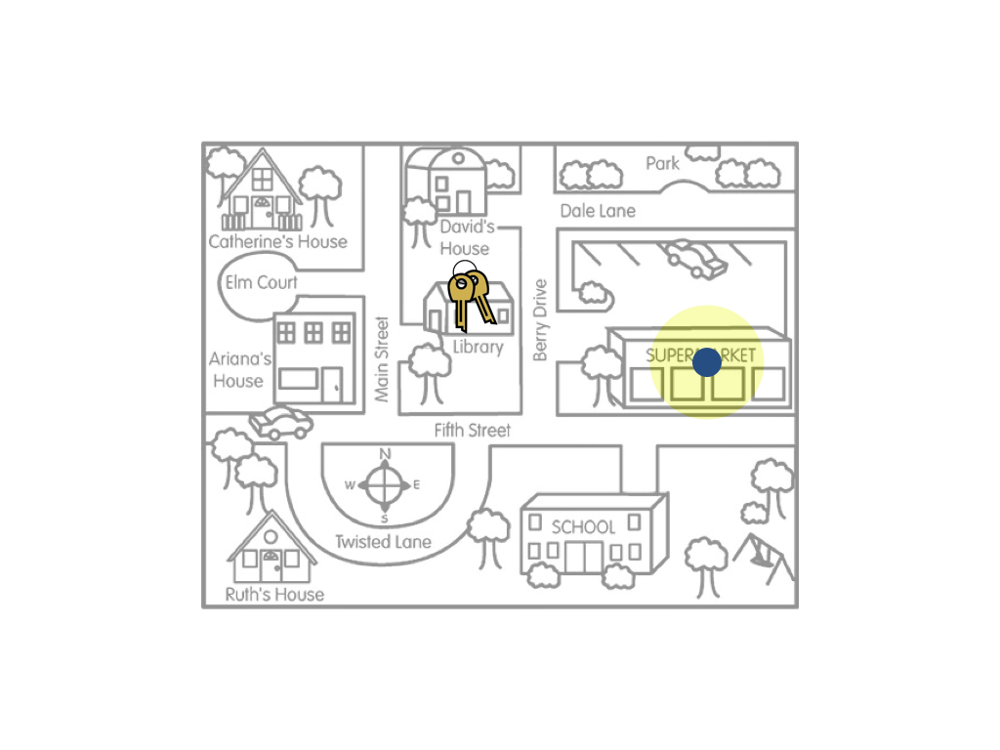

# Uncertainty and Bias {-}

Since statistical estimation is a method of inference, we need to weigh validity evidence the same way we did for tests of hypotheses. Whether the estimate is a "good" estimate depends on how the sample was drawn. If a biased method of drawing the sample was used, the interval estimate will likely be biased. Let's again illustrate using our key example.

The figure on the left is a metaphor for the interval estimate resulting from an unbiased sampling method, such as random sampling. The figure on the right is a metaphor for the interval estimate resulting from an biased sampling method, such as convenience sampling. Remember the goal of estimation is to give a range of likely values for the population parameter (the keys). If a biased sampling method is used the resulting interval estimate will likely be wrong (biased).

Don't confuse uncertainty with bias. In our key example, remember the amount of uncertainty is shown by the size of the yellow circle. In the figures above, the uncertainty for both the biased and unbiased sampling methods was the same. Now, consider the following figures.

The figure on the left is a metaphor for an interval that has a small amount of uncertainty (large sample size) resulting from a biased sampling method. The figure on the right is a metaphor for an interval that has a large amount of uncertainty (small sample size) resulting from an unbiased sampling method. In terms of estimating where the actual keys are, the interval represented in the right-hand figure would be better. This is an important lesson: **Sample size only matters if the sampling method is unbiased.**

