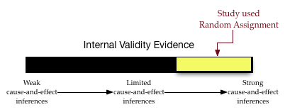

# Internal Validity Evidence and Random Assignment {-}

Medical researchers may be interested in showing that a drug helps improve people's health (the cause of improvement is the drug), while educational reserachers may be interested in showing a curricular innovation improves students' learning (the curricular innovation causes improved learning). 
To attribute a causal relationship, there are three criteria a researcher needs to establish:

- **Temporal Precedence:** The cause needs to happen BEFORE the effect.
- **Covariation of the Cause and Effect:** There needs to be a correlational relationship between the cause and effect.
- **No Plausible Alternative Explanations:** ALL other possible explanations for the effect need to be ruled out.

You can read more about each of these criteria at the [Web Center for Social Research Methods](https://www.socialresearchmethods.net/kb/causeeff.php). Especially because of this third criteria, attributing a cause-and-effect relationship is very difficult.

In an experimental study, this means that when you create them, the control group and the treatment group need to be "identical" with respect to every possible characteristic that could explain differences in the effect. This way the only characteristic that wil be different is that the treatment group gets the treatment and the control group doesn't. If there are differences in the outcome, then it must be attributable to the treatment, because the other possible explanations are ruled out.

So, the key is to make the control and treatment groups "identical" when you are forming them. One thing that makes this task (slightly) easier is that they don't have to be exactly identical, only [probabilistically equivalent](https://www.socialresearchmethods.net/kb/expequi.php). This means, for example, that if you were matching groups on age that you don't need the two groups to have identical age distributions; they would only need to have roughly the same AVERAGE age. Here roughly means "the average ages should be the same within what we expect because of sampling error."

Now we just need to create the groups so that they have, on average, the same characteristics &hellip; for EVERY POSSIBLE CHARCTERISTIC that could explain differences in the outcome. Zoinks!^[According to [Wiktionary](https://en.wiktionary.org/wiki/zoinks) the earliest usage of the work "zoinks" was by Norville "Shaggy" Rogers on the show Scooby-Doo.] 

It turns out that creating probabilistically equivalent groups is a really difficult problem. One method that works pretty well for doing this is to randomly assign participants to the groups. This works best when you have large sample sizes, but even with small sample sizes random assignment has the advantage of at least *removing the systematic bias* between the two groups (any differences are due to chance and will probably even out between the groups). As [Wikipedia's page on random assignment](https://en.wikipedia.org/wiki/Random_assignment) points out,

> Random assignment of participants helps to ensure that any differences between and within the groups are not systematic at the outset of the experiment. Thus, any differences between groups recorded at the end of the experiment can be more confidently attributed to the experimental procedures or treatment. &hellip; Random assignment does not guarantee that the groups are matched or equivalent. The groups may still differ on some preexisting attribute due to chance. The use of random assignment cannot eliminate this possibility, but it greatly reduces it.

Internal validity is the degree to which cause-and-effect inferences are accurate and meaningful. Causal attribution is the goal for many researchers. Thus, by using random assignment we have a pretty high degree of evidence for internal validity; we have a much higher belief in causal inferences. Much like evidence used in a court of law, it is useful to think about validity evidence on a continuum. We will visualize this continuum as a barometer. For example, a barometer visualizing the internal validity evidence for a study that employed random assignment in the design might be:

<br />

```{r out.width="70%", echo=FALSE, fig.align='center'}

```

<br />


The degree of internal validity evidence is high (in the upper-third). How high depends on other factors such as sample size.

To learn more about random assignment, you can read the following:

- The research report, [Random Assignment Evaluation Studies: A Guide for Out-of-School Time Program Practitioners](http://www.childtrends.org/wp-content/uploads/2008/01/Random-Assigment-Evaluations.pdf)


