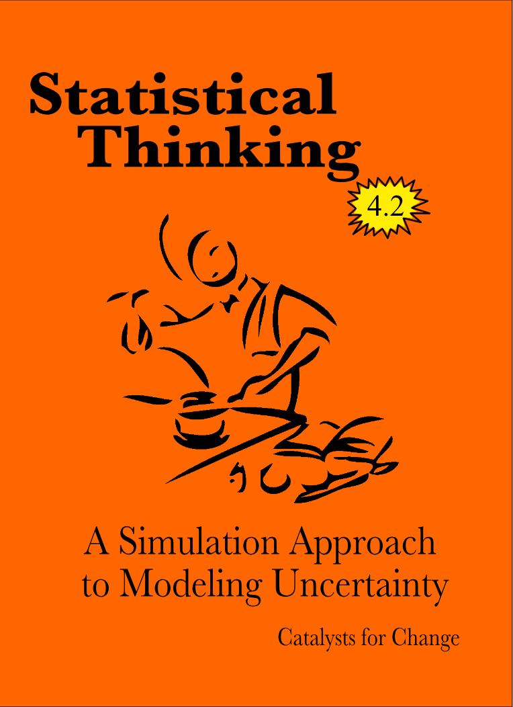

#  Front Matter {-}


```{r out.width="25%", echo=FALSE, fig.align='center'}

```

<br />

This website is intended to serve as an organizational hub for the most current version of the CATALST Project's *Statistical Thinking: A Simulation Approach to Modeling Uncertainty*. Here you will be able to access materials such as readings, data sets, and the lab manual. The website also includes helpful links and resources for each of the course topics.

<br />

The resources that accompany this website include:

- A lab manual [PDF copy available here](https://github.com/zief0002/statistical-thinking/blob/master/statistical-thinking-v4_1.pdf?raw=true)
- Data sets used in the lab manual [available here](https://github.com/zief0002/statistical-thinking/blob/master/data.zip?raw=true).

You can read more about these resources in the introduction.

<br />

### Licensing and Attribution {-}

Copyright &copy; 2019 Catalysts for Change

PUBLISHED BY CATALYST PRESS

<a rel="license" href="http://creativecommons.org/licenses/by/4.0/"></a>

This work is licensed under a <a rel="license" href="http://creativecommons.org/licenses/by/4.0/">Creative Commons Attribution 4.0 International License</a>. You are free to share, remix, and make commercial use of the work under the condition that you provide proper attribution. To reference this work, use:

- Zieffler, A., & Catalysts for Change. (2019). *Statistical Thinking: A simulation approach to uncertainty* (4.2th ed.). Minneapolis, MN: Catalyst Press. [http://zief0002.github.io/statistical-thinking/](http://zief0002.github.io/statistical-thinking/)

The work to create the material appearing in the book was made possible by the National Science Foundation (DUE–0814433). 

The material on this website and in the lab manual is a direct reflection of the ideas, work, and effort of several Catalysts for Change. They include (alphabetically): Ethan Brown, Jonathan Brown, Dan Butler, Beth Chance, George Cobb, Robert delMas, Katherine Edwards, Michelle Everson, Jeffrey Finholm, Chris Fiscus, Elizabeth Fry, Joan Garfield, Theresa Gieschen, Meg Goerdt, Robert Gould, Adam Gust, Melissa Hanson, John Holcomb, Michael Huberty, Rebekah R. Isaak, Kari Johnson, Nicola Justice, Laura Le, Suzanne Loch, Matthew Mullenbach, Michael Nguyen, Amy Okan, Allan Rossman, Anelise Sabbag, Andrew Zieffler, and Laura Ziegler


Additionally, some of the activities presented in the lab manual were originally developed by Beth Chance, George Cobb, John Holcomb, and Allan Rossman as part of their NSF-funded project [Concepts of Statistical Inference: A Randomization-Based Curriculum](http://statweb.calpoly.edu/csi/) (NSF CCLI- DUE-0633349). 

<br />


### Colophon {-}

There are two [Google Fonts](https://fonts.google.com/) used on the website. The headings use [Playfair Display](https://fonts.google.com/specimen/Playfair+Display) and the display text is [Alegreya](https://fonts.google.com/specimen/Alegreya).

Icons used on the website are:

- [Key](https://thenounproject.com/iconproducer/collection/keys/?oq=key&cidx=0&i=713748) by Iconic from the [Noun Project](https://thenounproject.com/)


